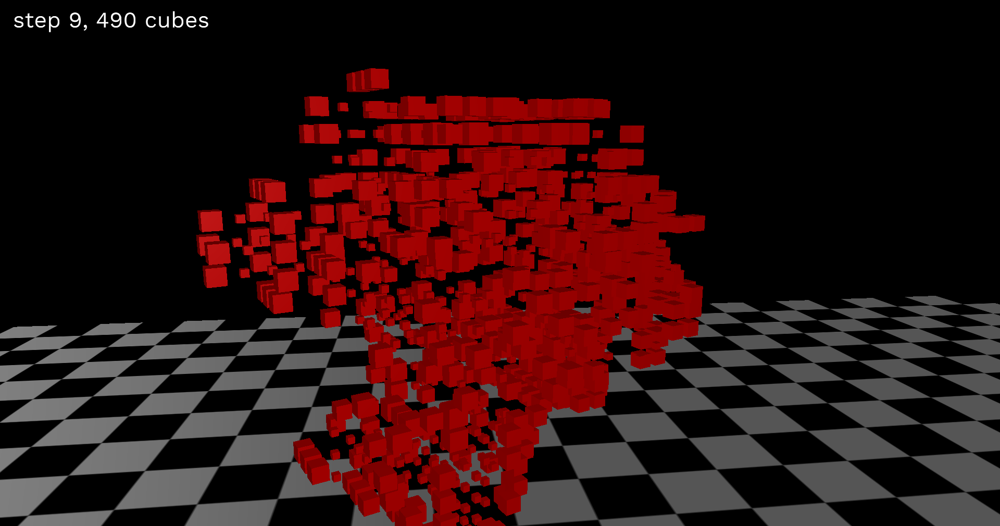

# AoC2020
my Advent of Code for 2020, this time in Rust

Contains:
* multithreading ✅️ (w [rayon](https://crates.io/crates/rayon))
* complex parsers ✅️ (w [nom](https://crates.io/crates/nom))
* graphs ✅️ (w [petgraph](https://crates.io/crates/petgraph))
* complex macros ✅️ (with syn and quote)
* nice command line interface ✅️ (w [clap](https://crates.io/crates/clap) )
* 3D renders! ✅️ {w [kiss3d](https://crates.io/crates/kiss3d)}
* long build times! ✅️ ( with all of the above...)

### Screenshots:

